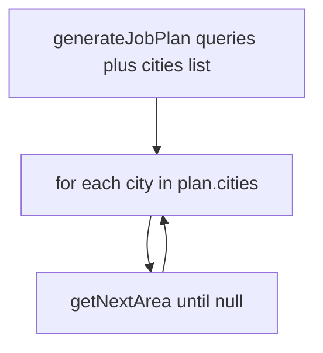

# AI planning: queries + full city list (area nav unchanged)

## Product shape

| Input | `generateJobPlan` returns |
|-------|---------------------------|
| **Optional city name set** | **Refined / enhanced queries** (3–5) + **`cities` length 1** — only that city (coordinates + `radius_meters`). |
| **No city** | Same **refined queries** + **`cities` = full list** of cities the model believes should be scraped for that query/country — **no upper or lower bound** on list length (model decides coverage; emphasize geographic spread / major urban centers as guidance only). **No second AI step for cities.** |

## Within-city scraping

- **`getNextArea`** ([`apps/server/src/ai/areaNavigation.ts`](apps/server/src/ai/areaNavigation.ts)) stays as-is: iterative areas inside one city.
- **Do not add** `getNextCity`, `cityNavigation.ts`, `NextCityContext`, or `PlannedCity` for city iteration.

## Worker loop (documentation only; no code in this slice unless you implement workers later)

1. `generateJobPlan(baseQuery, country, city?)` → `queries` + `cities[]`.
2. For **each** entry in `cities` (in order), run the scrape loop using **`getNextArea`** until it returns `null` for that city, then move to the next city.

## Code changes — [`apps/server/src/ai/jobPlanning.ts`](apps/server/src/ai/jobPlanning.ts)

Current [`buildPrompt`](apps/server/src/ai/jobPlanning.ts) still says “5–8 major cities” — **remove any fixed range** from the prompt. Updates to align:

- **Prompt copy**: Stress **refined / enhanced / fine-tuned** `queries` for Google Maps; when no user city, `cities` is the **complete** set of urban targets the model recommends — **no prescribed minimum or maximum** number of cities (only non-empty array).
- **Validation**: Non-empty `queries`; **exactly one city** when `city` arg provided; when no user city, **`cities.length >= 1`** only — do **not** require `>= 2` or cap list length.
- **Tokens**: Increase **`maxOutputTokens`** if needed (e.g. **2000** or higher) so long city lists are not truncated; tune after testing.

## Types — [`apps/server/src/ai/types.ts`](apps/server/src/ai/types.ts)

- **`JobPlan`**: Add short comments that `cities` is the **full** list for the job when no user city was specified, and **exactly one** when the user constrained the city.

## Barrel — [`apps/server/src/ai/index.ts`](apps/server/src/ai/index.ts)

- No new exports unless you add comments-only; **no** `getNextCity`.

## Explicitly out of scope

- New files for city-by-city AI; Inngest/DB wiring.
